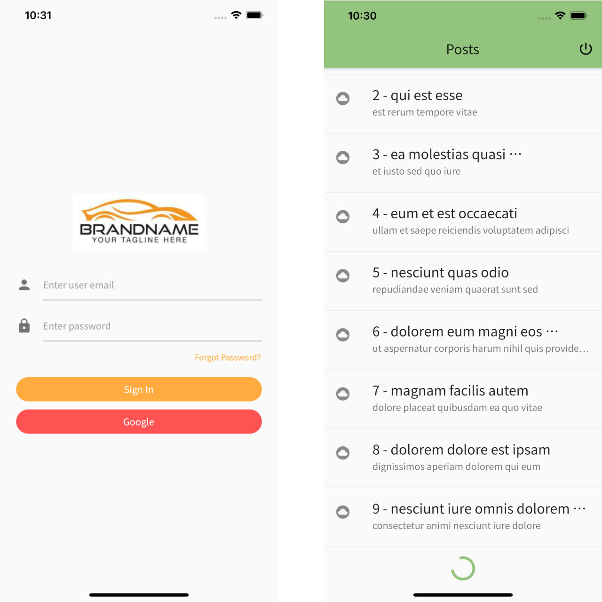

# app

A boilerplate project created in flutter using [MobX](https://github.com/mobxjs/mobx.dart), [get-it](https://pub.dev/packages/get_it), [Chopper](https://pub.dev/packages/chopper), [simple_auth](https://github.com/clancey/simple_auth)

> Basically, the whole architrecture was copied from [flutter-boilerplate-project](https://github.com/zubairehman/flutter-boilerplate-project). In the original project, it used Provider, but we replaced it with Get-It. Http client is auto-generated based on Chopper. OAuth-based authentication is simplified using simple-auth.

## Screen shots

## Getting Started

This project is a starting point for a Flutter application.

A few resources to get you started if this is your first Flutter project:

- [Lab: Write your first Flutter app](https://flutter.dev/docs/get-started/codelab)
- [Cookbook: Useful Flutter samples](https://flutter.dev/docs/cookbook)

For help getting started with Flutter, view our
[online documentation](https://flutter.dev/docs), which offers tutorials,
samples, guidance on mobile development, and a full API reference.
